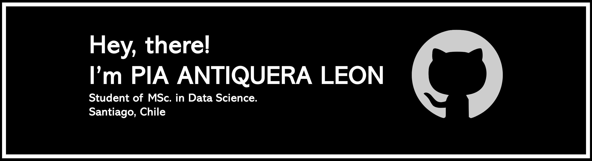

<!--
**piaantiquera/piaantiquera** is a ✨ _special_ ✨ repository because its 
`README.md` (this file) appears on your GitHub profile.

-->

    

 

    
       

<samp>
I'm a MSc. Data Science candidate student at the Universidad de Chile. 
Currently, working as a research assistant at the Complex Engineering 
Systems Institute and the Web Intelligence Centre. Additionally, I'm a 
teaching assistant for courses related to data science at the Department 
of Industrial Engineering, Universidad de Chile. 
</samp>

 

<samp>           
My areas of interest in data science include artificial intelligence, with 
a special focus on <strong>natural language processing</strong>, 
<strong>computer vision</strong>, and </strong>machine learning</strong>.
    
</samp>
    
------------

<h1 align="center"> TECH STACK </h1>
<table><tr><td valign="top" width="33%">

  
<h2> <samp> LANGUAGES </samp>  </h2>

</td><td valign="top" width="33%">
    

 
<h2> <samp>DATABASES </samp>  </h2>

</td><td valign="top" width="33%">

  
<h2> <samp> CLOUD COMPUTING </samp>  </h2>

</td></tr><tr><td valign="top" width="33%">

  
<h2> <samp>BUSINESS ANALYTICS </samp>  </h2>

</td><td valign="top" width="33%">

  
    <h2> <samp> FRAMEWORKS</samp>   </h2>

</td><td valign="top" width="33%">

  
<h2> <samp>VERSION CONTROL </samp>  </h2>

</td></tr><tr><td valign="top" width="33%">

  
<h2> <samp>SERVER MAMAGEMENT</samp>  </h2>

</td></tr></table>

<h3 align="right" style="font-size: 24px;"> CONTACT ME: &nbsp;&nbsp; 
&nbsp;&nbsp;
  
  
  
</h3>

